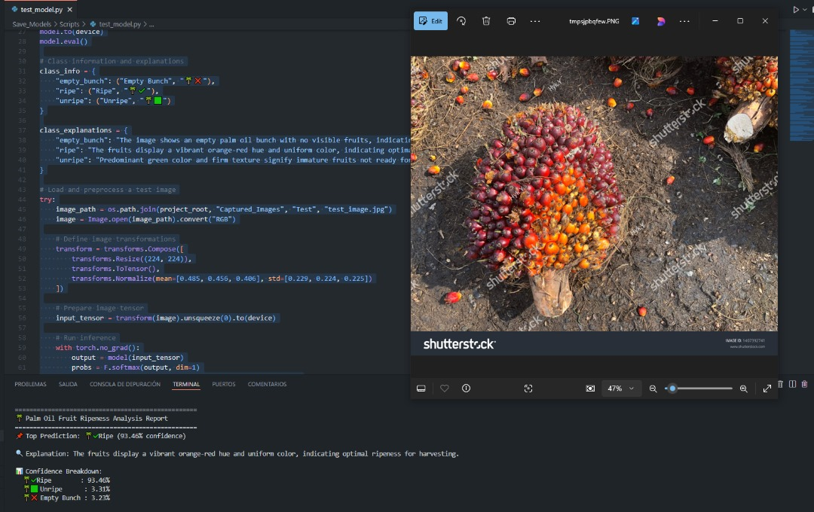
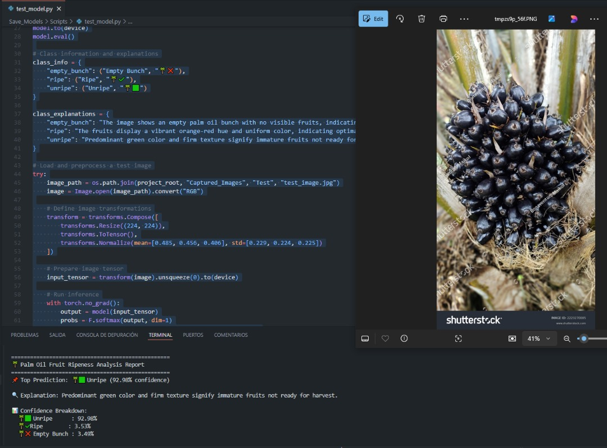
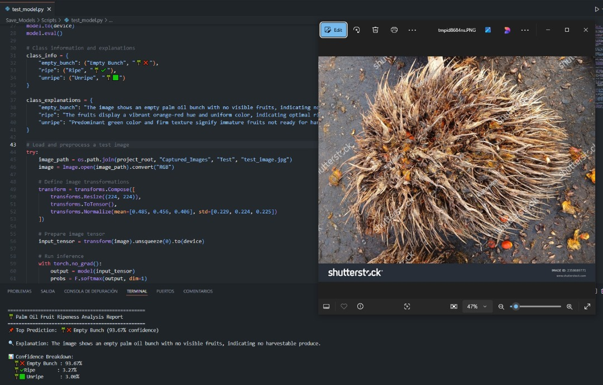

# Palm Oil Fruit Ripeness Classifier 🌴📸

[](https://www.python.org/downloads/)
[](https://pytorch.org/)
[](https://opensource.org/licenses/MIT)
[](https://github.com/Owono2001/)

> A Vision Transformer (ViT) based AI model for accurately classifying the ripeness of palm oil fruit bunches (Ripe, Unripe, Empty) using standard RGB camera images. This project achieves **99.96% validation accuracy** and supports real-time inference, including deployment on Raspberry Pi.

---

## 🍇 Sample Classifications

The model classifies palm oil fruit bunches into three categories:

| Class       | Sample Image                     | Indicator | Description                  |
| :---------- | :-------------------------------: | :-------: | :--------------------------- |
| **Ripe** |       | 🟠        | Ready for harvest.           |
| **Unripe** |    | 🟢        | Not yet ready for harvest.   |
| **Empty** | | ⚫        | Bunch with no fruit present. |

---

## 📋 Table of Contents

* [🌟 Features](#-features)
* [🛠️ Installation](#️-installation)
* [🚀 Usage](#-usage)
* [📐 Model Architecture](#-model-architecture)

---

## 🌟 Features

* 🧠 **High Accuracy:** Leverages a Vision Transformer (ViT) model achieving **99.96% validation accuracy**.
* 🕒 **Real-time Inference:** Classify fruit bunches instantly using a connected webcam.
* 📱 **Raspberry Pi Compatible:** Includes setup instructions and considerations for deployment on Raspberry Pi.
* 📊 **Three-Class Output:** Distinguishes between:
    * 🟠 Ripe Bunch
    * 🟢 Unripe Bunch
    * ⚫ Empty Bunch
* 🔄 **ONNX Export:** Provides scripts to convert the PyTorch model to ONNX format for optimized inference and cross-platform compatibility.

---

## 🛠️ Installation

### Prerequisites

* Python 3.8 or newer
* A connected webcam (for real-time inference)
* PyTorch 2.0.0 or compatible version (see `requirements.txt`)

### Setup Steps

1.  **Clone the repository:**
    ```bash
    git clone [https://github.com/Owono2001/AI_Model_Palm_Oil_Fruit.git](https://github.com/Owono2001/AI_Model_Palm_Oil_Fruit.git)
    cd AI_Model_Palm_Oil_Fruit
    ```

2.  **Create and activate a virtual environment:** (Recommended)
    ```bash
    python -m venv venv
    ```
    * On **Windows**: `.\venv\Scripts\activate`
    * On **Linux/macOS**: `source venv/bin/activate`

3.  **Install dependencies:**
    ```bash
    pip install -r requirements.txt
    ```

---

## 🚀 Usage

### Real-time Inference (Webcam)

1.  Ensure your virtual environment is activated and webcam is connected.
2.  Run the classification script:
    ```python
    python Inference/DoClassify_RGB.py
    ```
3.  Point the camera towards palm oil fruit bunches. The classification result will be displayed on the video feed.
4.  Press `q` to exit the application.

### Training

1.  Prepare your dataset according to the expected format (details should be added if not standard ImageFolder).
2.  Run the training script:
    ```python
    python Training/Train_RGB.py
    ```
    *(Modify training parameters within the script or via command-line arguments if implemented).*

### Model Conversion (PyTorch to ONNX)

1.  Convert the trained PyTorch model (`.pth`) to ONNX format for optimized deployment:
    ```python
    python Save_Models/scripts/convert_onnx.py
    ```
    *(Ensure model paths in the script are correct).*

---

## 📐 Model Architecture

This project utilizes the **Vision Transformer (ViT)** architecture, specifically `vit_base_patch16_224` pre-trained on ImageNet and fine-tuned for this task. The core structure involves:

* **Patch Embedding:** Input images (224x224) are divided into 16x16 patches, flattened, and linearly embedded.
* **Transformer Encoder:** A stack of 12 Transformer Encoder layers processes the sequence of patch embeddings, capturing global image context through self-attention mechanisms.
* **Classification Head:** A final linear layer maps the processed sequence representation to the 3 output classes (Ripe, Unripe, Empty).

```python
# Conceptual Structure (based on standard ViT)
VisionTransformer(
  (patch_embed): PatchEmbed(...)
  (pos_drop): Dropout(...)
  (blocks): Sequential(
    (0): Block(...) # Transformer Encoder Layer 1
    (1): Block(...) # Transformer Encoder Layer 2
    ...
    (11): Block(...) # Transformer Encoder Layer 12
  )
  (norm): LayerNorm(...)
  (head): Linear(in_features=768, out_features=3, bias=True) # Classifier
)
